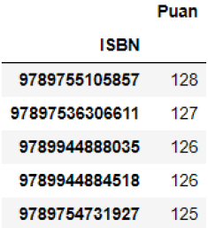
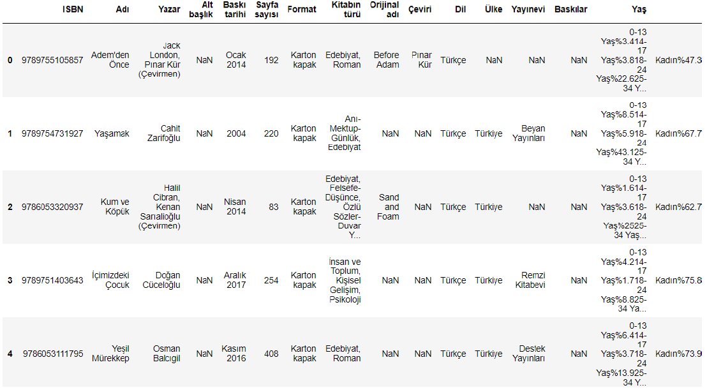

# Book Recommendation System with Crawled Data from Web
In this project we tried to build a Book Recommendation System which uses books, ratings and users data. We calculated correlations with Pearson Correlation Coefficient between users. Book data crawled from [1000 kitap](https://1000kitap.com/kitaplar?s=en-cok-okunanlar). Users and ratings data generated randomly with respect to rating data (rating data-3, rating data+3) in book file.

